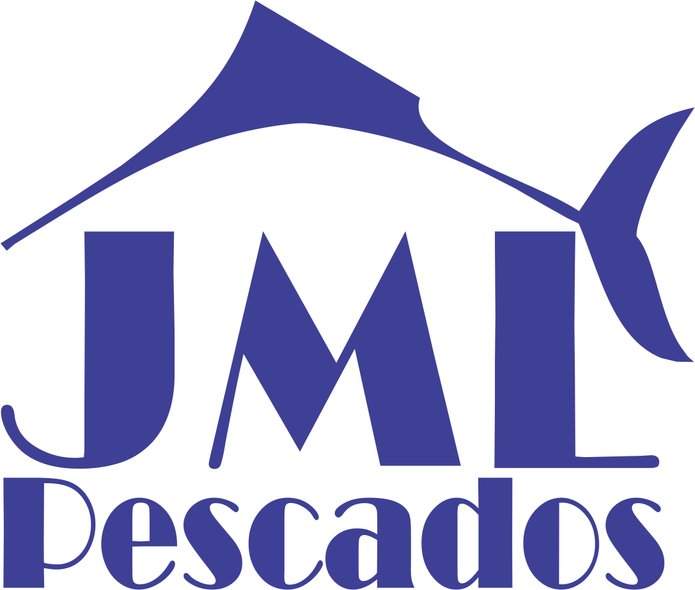

# JML-Pescados - Sistema de Gestão Financeira



## 📋 Descrição
Sistema de gestão financeira desenvolvido para a JML-Pescados, permitindo o controle de entrada e saída de recursos, com foco especial no gerenciamento de grudes e despesas gerais.

## ✨ Funcionalidades

### Gestão de Grudes
- Cadastro de grudes com nome, quantidade e valor por kg
- Cálculo automático de totais
- Interface intuitiva para adição e remoção de registros

### Controle de Despesas
- Registro de despesas gerais
- Categorização e descrição detalhada
- Cálculo automático do saldo

### Relatórios
- Exportação para Excel
- Geração de PDF
- Visualização mensal dos dados

### Recursos Adicionais
- Salvamento automático dos dados
- Interface responsiva
- Cálculos em tempo real
- Formatação de valores em moeda brasileira

## 🚀 Tecnologias Utilizadas
- HTML5
- CSS3
- JavaScript
- jsPDF (para geração de PDF)
- SheetJS (para exportação Excel)

## 💻 Como Usar

1. Clone o repositório
```bash
git clone [URL_DO_REPOSITÓRIO]
```

2. Abra o arquivo `index.html` em seu navegador

3. Comece a utilizar:
   - Adicione grudes com suas respectivas quantidades e valores
   - Registre despesas gerais
   - Visualize os totais atualizados automaticamente
   - Exporte relatórios quando necessário

## 📊 Estrutura do Projeto
```
jml-pescados/
├── index.html          # Interface principal
├── styles.css          # Estilos da aplicação
├── script.js           # Lógica da aplicação
└── public/            # Arquivos estáticos
    ├── celso.png      # Logo da empresa
    └── LogoCelso.png  # Ícone do site
```

## 🔒 Armazenamento
- Os dados são salvos localmente no navegador
- Cada mês possui seu próprio conjunto de dados
- Backup automático ao salvar

## 📱 Responsividade
- Interface adaptável a diferentes tamanhos de tela
- Design moderno e profissional
- Experiência de usuário otimizada

## 🔄 Atualizações
- Cálculos em tempo real
- Atualização automática dos totais
- Salvamento automático das alterações

## 📄 Licença
Este projeto está sob a licença proprietária da JML-Pescados. Todos os direitos reservados.

## 👥 Suporte
Para suporte ou dúvidas, entre em contato com a equipe de desenvolvimento.

---
Desenvolvido com ❤️ para JML-Pescados 